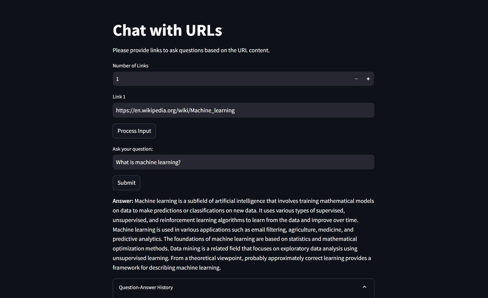

# Chat with URLs

**Chat with URLs** is a web-based Q&A tool that allows users to input one or multiple URLs and ask questions based on the content from those links. The tool processes the text content from the provided URLs and enables the user to query the information from them.

This project is built using **Streamlit**, **LangChain**, **FAISS**, and other supporting libraries.

## Features
- Input multiple URLs
- Automatically processes the content from the URLs
- Ask questions based on the extracted content
- Displays a question-answer history for reference

## Tech Stack
- **Streamlit**: For the web interface
- **LangChain**: For processing and handling the documents
- **FAISS**: For vector search and similarity queries

## Prerequisites

Before running the project, ensure you have the following installed:
- Python 3.8+
- Streamlit
- Required Python libraries
- HuggingFace API key for embedding and model inference

## Installation

1. **Clone the Repository**:
   ```bash
   git clone https://github.com/gaurav0199/Chat-With-URLs.git
   cd Chat-With-URLs

2. **Install requirements**:
    ```bash
    pip install -r requirements.txt

3. **Run Application**:
    ```bash
    streamlit run app.py

## Demo

